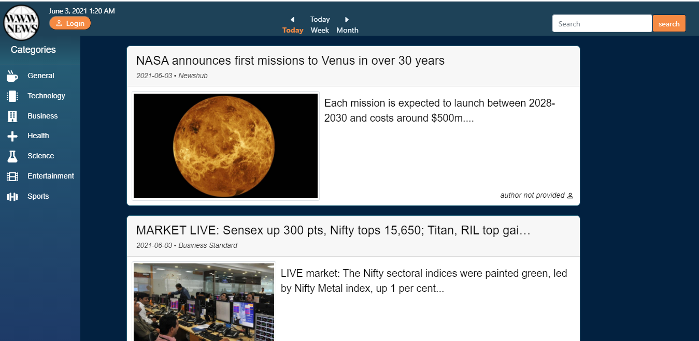
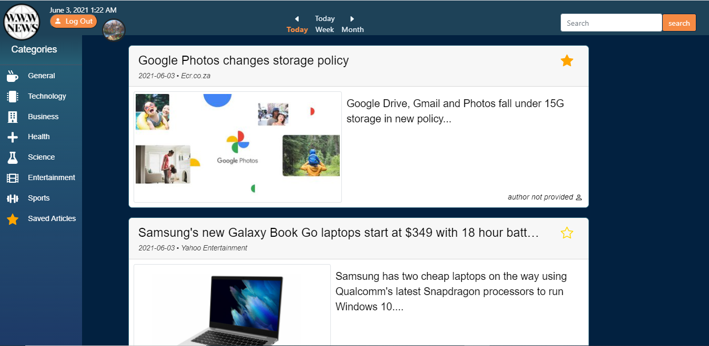

# News App
  ## Collaborators - Bryan Thaoxaochay, Calvin Jacobsen, Brandon Norrgard, Noah Schlag, Jim Nguyen
 
    

  * [Installation](#installation)
  * [Heroku](#heroku)

  
  
  ------------------------------------
  
  ## Description

  The goal of this project was to pull as many sources for topics to give our user as many viewpoints as possible on any given topic.  Using data from NewsAPI.org, this application allows the user to pull top headlines from different categories and search for articles using different keywords for areas of interest.

    

  
  We wanted this page accessible to anyone looking for news content.  With that goal in mind, all of our functions work when you visit our page.  If our user would like to save an article to view later, there is an option to log in and view articles at a later date. 

  
  

  ### Technologies Used
  * MongoDB / Mongoose
  * Express
  * React
  * Node.js
  * API's 
  * Auth0
  * JavaScript
  * CSS
  * Bootstrap / React Bootstrap
  * Models
  * Routing
  
  ------------------------------------
  
  ## Installation
  
  To install this application, you will need to enter the following line of code into a Node.js session.  
      
      npm install
  
  
  ------------------------------------

  ## Heroku
  
  Link to deployed application
      
  https://news-app-5.herokuapp.com/
  
  
  ------------------------------------
  

  
  

